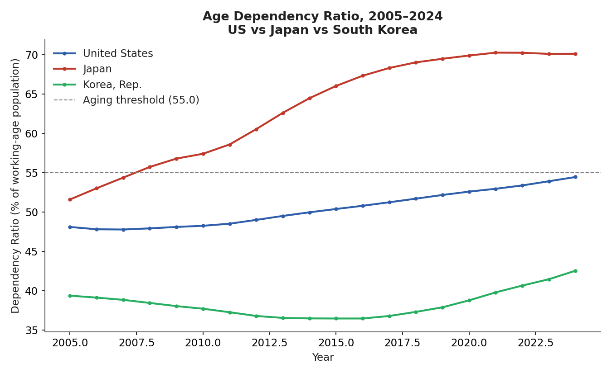
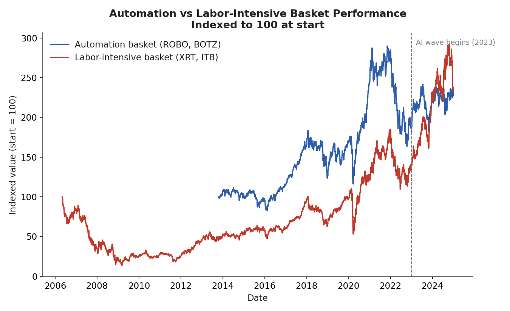
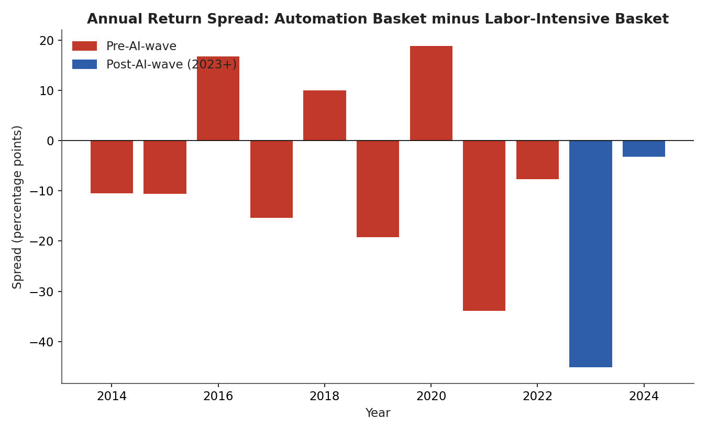
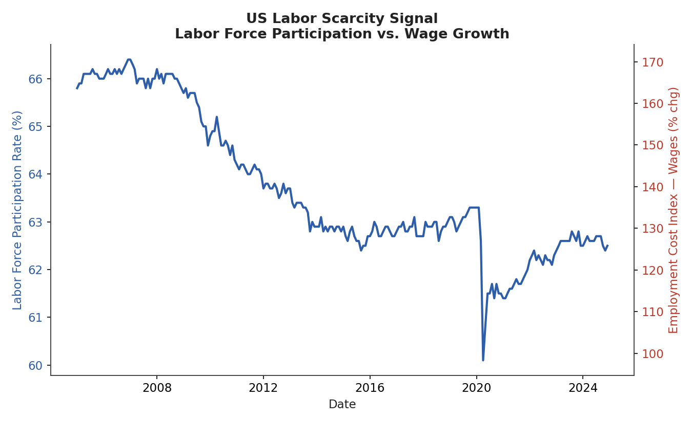
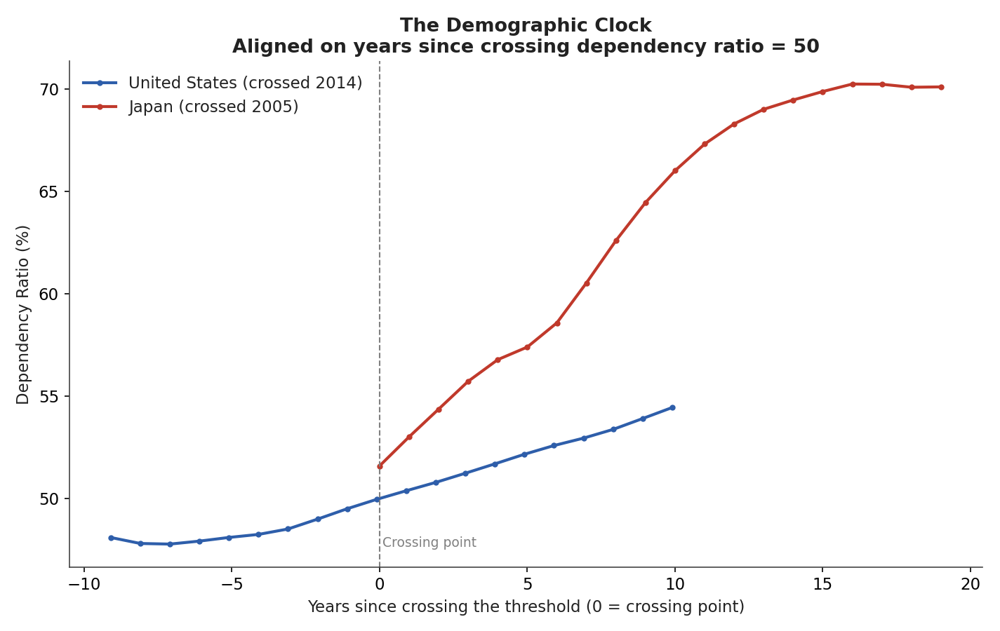
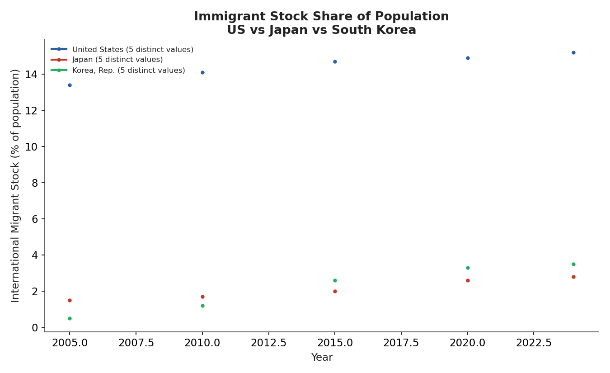

# Checkpoint 1 — Demographic Dividend Reversed
**Investing Around a Shrinking Workforce**

*Note on this checkpoint: per program guidance, this submission prioritizes process over output. The goal is a working, honest pipeline and a documented account of how the analysis was built — not a finished or polished conclusion. The verdict below is provisional and expected to change as the analysis is extended in later checkpoints.*

## Thesis
Birth rates are collapsing across developed and middle-income nations. This thesis maps the investment implications — automation, immigration policy, pension system stress — and identifies which industries structurally shrink versus benefit from a tighter labor market over the coming decades.

## Written Verdict
This section is the full stance and verdict for this checkpoint, written to stand on its own: what I believed before looking at any data, what I actually tested, what the data showed, and what that means going forward. The detailed methodology, statistics, and charts supporting each part follow later in this report.

### 1. The Stance, Formed Before Looking at Data
Demographic aging is shrinking the US labor force, and that pressure is real and measurable, not speculative. Historically, the US absorbed much of that pressure by staying relatively open to immigration compared to Japan and South Korea. That offset is weakening now, right as the demographic pressure keeps building, which is part of why automation investment accelerated starting around 2023 — not purely because the technology got better, but because the easier alternative, importing labor, has gotten harder at the same time it was needed most. Japan and South Korea, having had little immigration to begin with for decades, are the longer-running case of what happens when automation has to carry more of the load on its own.

This is one connected mechanism, not two separate claims being tested side by side: labor scarcity is the cause, immigration access is the valve that has historically relieved it, and automation is the response that takes over as that valve narrows. Only the demographic and automation-timing pieces of this are tested directly with statistics in this checkpoint; the recent immigration-tightening piece is used as explanation for *why now*, not as a second variable with its own regression, since it happened in the same narrow time window as the AI wave itself and the two cannot be cleanly separated statistically with the data available here.

### 2. What Was Tested, and What the Data Actually Showed
**Part 1, the demographic mechanism: supported.** Age dependency ratios are rising in all three countries, with a statistically significant upward trend in the US and Japan. This confirms the core premise is real, not an assumption taken on faith. Full regression results are in Part 1 below.

**Immigration as historical context: directionally supported.** The US's migrant stock share of population is roughly four to six times higher than Japan's or South Korea's across every available data point in the 2005-2024 window, consistent with the US having a real, structural immigration offset that Japan and South Korea do not. Detail and a data quality caveat are in the Immigration section below.

**Part 2, the investment timing claim: not yet supported.** The automation basket used to test this (ROBO, BOTZ) underperformed the labor-intensive comparison basket after 2023, the opposite of what the stance predicted. Rather than treat this as the thesis being wrong, the result was investigated and traced to a specific, identifiable problem: ROBO and BOTZ are industrial robotics funds, holding companies like Fanuc and ABB, not generative-AI funds. They predate and do not track the specific automation wave this stance is actually about. The test, as built, could not distinguish the older robotics cycle from the generative-AI cycle, so it could not fairly confirm or deny the timing claim. Full detail is in Part 2 and the Limitations section below.

### 3. What This Means Going Forward
The mechanism this thesis depends on, real labor scarcity from an aging, less-immigration-supported workforce, is solidly confirmed by this checkpoint's data. The specific claim that AI-era automation investment is already capturing that opportunity is unproven, but for a reason that points to a fixable next step rather than a dead end: the next checkpoint should re-run the same test with a basket that actually tracks generative-AI and agentic-automation exposure, rather than older industrial robotics names, before drawing a final conclusion on the timing claim.

## Stance by Pillar, Before Looking at Data
The full thesis names four channels through which demographic contraction is expected to affect markets: automation, immigration policy, pension system stress, and which industries structurally shrink versus benefit. This checkpoint does not test all four with equal depth. The table below states a directional stance on each, formed before pulling any data, and marks honestly which ones were actually tested this checkpoint versus named as a belief carried into future checkpoints.

| Pillar | Stance (formed before looking at data) | Tested this checkpoint? |
|---|---|---|
| Automation | Automation is the primary response to labor scarcity, and that response is accelerating now, both from demographic pressure and from a narrowing immigration offset, but is not yet fully priced in. | Yes — see Part 2 and the verdict above. |
| Immigration policy | The US has historically relied on relatively open immigration to offset labor scarcity that Japan and South Korea, historically closed, could not. That offset is narrowing recently, adding to demographic pressure rather than replacing it as a separate cause. | Partially — the historical offset is tested with real data below; the recent-tightening effect is named as context, not separately tested. |
| Pension system stress | Countries further along the demographic clock (see below) and with less immigration offset face more acute pension and sovereign fiscal stress, not yet fully reflected in sovereign debt pricing. | Not yet — directional belief only, planned for a later checkpoint using FRED/IMF fiscal data. |
| Sector winners vs. losers (beyond automation) | Healthcare and eldercare benefit from an aging population directly; broad low-margin, labor-intensive domestic services (retail, hospitality, construction) are structurally exposed in countries without an immigration offset. | Not yet — only the automation-vs-labor-intensive comparison was tested this checkpoint, not a broader sector map. |

## Process — What Went Right
- Found that World Bank and yfinance both expose free, no-auth-required APIs, which made it possible to build a fully reproducible pipeline with no API key management or credential handling.
- Separated the project into a data layer (`data_engine.py`) and an analysis/reporting layer (`analysis.py`), which made it straightforward to keep data-pulling logic separate from statistical testing and reporting — easier to debug and easier to extend in later checkpoints.
- Tested all pipeline logic against mock data shaped like the real API responses before running it against live data, which caught structural bugs (e.g., basket-index alignment, date-split logic) early and cheaply.
- Operationalized the stance as a precise, falsifiable rule (`post-2023 spread > 0 AND post-2023 spread > pre-2023 spread`) rather than a vague directional claim, so the verdict is a real test rather than a narrative fit to whatever the data showed.

## Process — What Went Wrong / What Was Harder Than Expected
- The original plan was to test the thesis across 5+ countries; narrowed to three (US, Japan, South Korea) once it became clear that maintaining data quality and a clean regression across more countries would cost more time than it added insight at this stage.
- The first version of the verdict logic was a simple "did automation beat labor-intensive stocks" binary test. That test didn't actually match this thesis's stance, which is about *timing* — whether the investment response is accelerating, not just whether it's positive — so it was rebuilt around a pre/post AI-wave split instead. Worth noting as a reminder to test that an analysis actually matches the hypothesis being argued, not just a plausible-sounding nearby test.
- ETF baskets (ROBO, BOTZ, XRT, ITB) are an imperfect, somewhat blunt proxy for "automation exposure" vs. "labor-intensive exposure" — this was a known tradeoff made for checkpoint speed, with individual-stock granularity flagged as a next-tier improvement rather than solved now.
- The post-AI-wave window (2023–2024) is short, which limits how much weight the t-test result can carry. This was anticipated going in, but is worth stating plainly rather than letting the headline verdict imply more confidence than the sample size supports.
- The interactive dashboard (`app.py`) failed on first run with `No module named 'yfinance'`, even after confirming via `pip install yfinance` that it was installed. Root cause: `which python` and `which streamlit` pointed to two different Python installs on the machine (Anaconda's Python vs. a separate Python.framework install) — `pip` was installing into one environment while Streamlit was launching from another. Fixed by running `python -m streamlit run src/app.py` to force Streamlit to use the same interpreter that had the dependencies installed. A reminder that "pip says it's installed" and "the running process can see it" are not the same claim, especially on machines with multiple Python installs.
- A code edit aimed at adding a new chart function accidentally deleted the function signature of an existing one (`chart_labor_scarcity`), leaving its body orphaned in the file. This was not caught by reading the diff alone — it surfaced immediately on the next full pipeline test run as a `NameError`, which is the main reason every change in this project was re-tested end-to-end rather than assumed correct after editing.

## Methodology
1. Pulled annual age-dependency ratios (2005–2024) for the US, Japan, and South Korea from the World Bank API to confirm the demographic mechanism is real and accelerating.
2. Pulled daily prices for an automation/robotics ETF basket (ROBO, BOTZ) and a labor-intensive/domestic-consumption basket (XRT retail, ITB homebuilders) via yfinance.
3. Split the basket performance comparison at the AI-wave inflection point (January 2023, following ChatGPT's late-2022 public release) and tested whether the automation-vs-labor return spread is larger post-split than pre-split.
4. Ran a Welch's t-test on annual spread values pre- vs. post-split.

## Part 1 — Is the Demographic Mechanism Real?

| Country | Dependency Ratio Trend (pts/year) | R² | p-value |
|---|---|---|---|
| United States | +0.373 | 0.964 | 0.0000 |
| Japan | +1.090 | 0.939 | 0.0000 |
| Korea, Rep. | +0.116 | 0.154 | 0.0875 |

A positive, statistically significant slope confirms dependency ratios are rising — i.e., the working-age population is shrinking relative to dependents — across all three countries, consistent with the thesis's core premise.

## The Demographic Clock — An Unexpected Angle

Rather than treating the US, Japan, and South Korea as three independent data points on a calendar-year x-axis, this checkpoint re-aligns all three countries on **years since crossing a common dependency-ratio threshold (50)**. The idea: Japan and South Korea are not just 'other countries' — they are the US's own trajectory at different points in time. Reading their post-crossing history can act as a preview of what the US is approaching, rather than treating all three as separate, disconnected cases.

| Country | Year crossed threshold | Implied lead/lag vs. other countries |
|---|---|---|
| Japan | 2005.0 | earliest — reference point |
| United States | 2014.1 | crosses ~9.1 years after Japan |
| Korea, Rep. | not yet crossed in this window | — |

**A related observation worth flagging explicitly: South Korea's dependency ratio does not rise monotonically.** It declines for roughly the first decade of the data window before inflecting sharply upward. This is not a data artifact — it reflects Korea moving through the tail end of its own demographic dividend (falling youth dependency outpacing rising elderly dependency) before the aging effect takes over. Most framings of this thesis would expect a straight upward line for every aging country; Korea's chart instead shows the actual turning point from dividend to tax happening within the sample window — and shows Korea moving through that transition faster than Japan did at the same stage, consistent with Korea's lower fertility rate.

This reframing does not change the Part 2 verdict below, but it changes how the US result should be read: the US has only just reached the alignment threshold within this data window. If Japan and Korea's post-crossing histories are any guide, the effects this thesis is testing for (automation investment acceleration, wage pressure, sector divergence) may simply not have had time to show up in the US data yet — which is itself consistent with, not contrary to, the 'early innings' stance.

## Immigration — Historical Context for the Automation Timing Claim
This section is not a separate, independently tested pillar. It supports the written verdict above: the claim that the US has historically used relatively open immigration to absorb labor scarcity in a way Japan and South Korea, both historically closed, have not been able to. That gap is part of why the US shows weaker demographic urgency than Japan or Korea over the full 2005-2024 window, and why a recent narrowing of that offset matters for the timing of automation investment, rather than being a second, independently tested cause.

| Country | Latest migrant stock (% of population) | Distinct values in window | Years covered |
|---|---|---|---|
| United States | 15.2% | 5 | 20 |
| Japan | 2.8% | 5 | 20 |
| Korea, Rep. | 3.5% | 5 | 20 |

**A data quality caveat that matters more here than anywhere else in this checkpoint.** World Bank labels migrant stock share "annual," but the table above shows far fewer distinct values than years covered, confirming the underlying UN source data is only genuinely updated roughly every 5 years. The chart below reflects that directly rather than implying smoother annual change than the data supports. Net migration (the flow measure, as opposed to migrant stock share) is even sparser, reported only on 5-year UN estimate windows, so it is summarized here rather than charted on its own.

**Reading the result against the stance.** Even with infrequent updates, the gap between the US and Japan/Korea's migrant stock share is large and persistent across every available data point, consistent with the stance that the US has a real, structural immigration offset that Japan and South Korea do not. This is directional support for the immigration pillar, not a precise trend test — the data's update frequency does not currently allow for the same kind of regression or significance testing used for the dependency ratio in Part 1.

## Part 2 — Has the Investment Response Already Happened, or Is It Just Beginning?

- **Pre-AI-wave spread (2005–2022):** automation basket outperformed labor-intensive basket by **50.7 percentage points** (cumulative).
- **Post-AI-wave spread (2023–2024):** automation basket outperformed labor-intensive basket by **-48.3 percentage points** (cumulative).
- **Spread accelerating post-AI-wave:** False
- **Welch's t-test (post vs. pre annual spread):** t = -0.846, p = 0.5363 (n_pre=9, n_post=2)

## Provisional Verdict (Checkpoint 1): NOT YET SUPPORTED

The data does not yet show a larger automation-vs-labor spread post-AI-wave than pre-AI-wave. Before treating this as a verdict on the thesis itself, it is worth being precise about what the test actually measured.

**A likely driver: the automation basket is a poor proxy for the generative-AI wave specifically.** ROBO and BOTZ are industrial robotics ETFs — their largest holdings (e.g., Fanuc, ABB, Keyence, Intuitive Surgical) are pre-genAI-era automation companies, not generative-AI or agentic-automation names. Meanwhile XRT (retail) and ITB (homebuilders) both had unusually strong 2023-2024 runs for reasons unrelated to demographics (resilient post-COVID consumer spending, rate-cut anticipation lifting homebuilders). So this result is better read as *the test could not distinguish industrial-robotics-era performance from generative-AI-era performance*, rather than as evidence against the underlying mechanism.

This sharpens rather than undermines the checkpoint: the demographic mechanism (Part 1) holds up cleanly, but the basket used to test the *investment response* needs to be more specifically AI-software-exposed (e.g., AIQ, IRBO, or a custom basket of AI-infrastructure names) rather than industrial-robotics ETFs, to actually test the early-innings generative-AI-wave stance. That is the top priority fix for the next tier of this analysis.

Other contributing factors worth naming: (a) the post-2023 window is still short, limiting statistical power; (b) the market may have already priced in some automation premium during the 2017-2020 robotics cycle, ahead of the generative-AI wave this thesis is actually about.

## Charts

**Bonus chart** (beyond the 2-3 required) — a direct US-specific check on labor scarcity using FRED data, independent of the World Bank dependency-ratio series:

## Limitations
- Correlation between demographic trend and basket performance does not establish causation; confounders include Fed policy, the broader AI hype cycle, USD strength, and sector-specific catalysts unrelated to demographics.
- The post-AI-wave window (2023 to 2024) covers roughly two years of data, which limits statistical power for the t-test. A 2026 re-run with a more AI-specific basket would capture a fuller picture of whether the effect has materialized.
- ETF baskets are imperfect proxies; ROBO/BOTZ include industrial robotics exposure that predates the generative-AI wave, and XRT/ITB conflate several distinct labor-intensive sub-sectors.
- A single dependency-ratio threshold (55) is used to classify Aging/Young regimes; sensitivity to this threshold is not yet tested (planned for next tier).
- Only three countries are analyzed; broader middle-income coverage (per the original thesis scope) is planned for a later checkpoint.

## Next Steps (toward higher tier)
- **Top priority:** replace ROBO/BOTZ with a basket that actually targets the generative-AI / agentic-automation wave (e.g., AIQ, IRBO, or a custom basket of AI-infrastructure and AI-software names) so the test isolates the specific mechanism the stance is about, rather than industrial robotics broadly.
- Add immigration-policy variable as a moderating factor (US/Canada open vs. Japan/Korea closed) to test the pairs-trade angle of the thesis.
- Add pension-system / sovereign fiscal stress indicators (FRED, IMF).
- Test sensitivity of the verdict to the dependency-ratio threshold and the AI-wave split date.
- Expand automation/labor baskets to individual names for sector-level granularity.